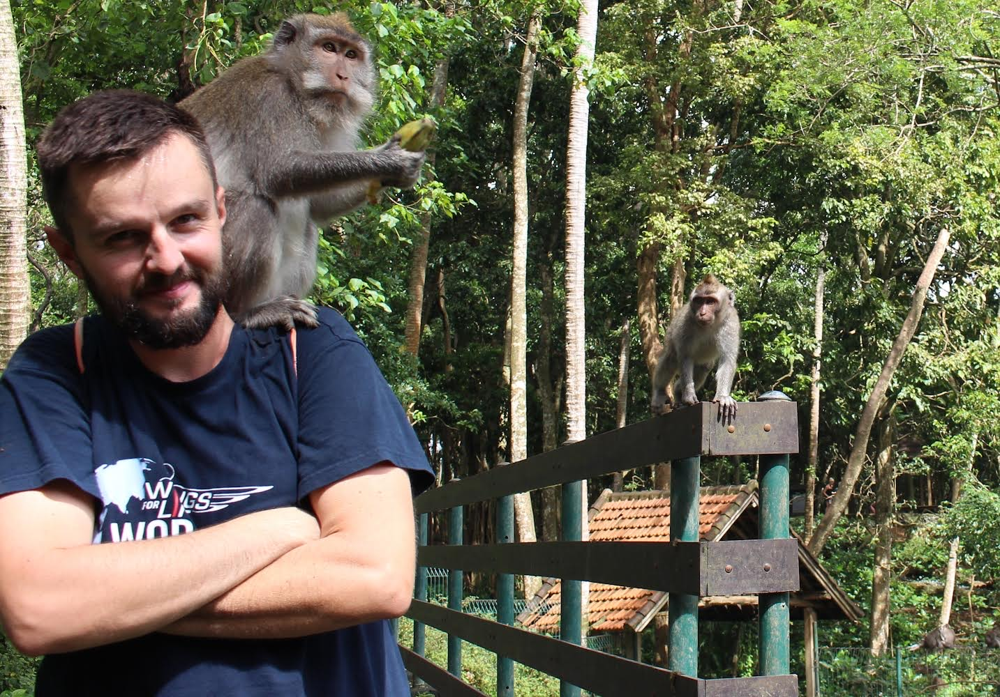
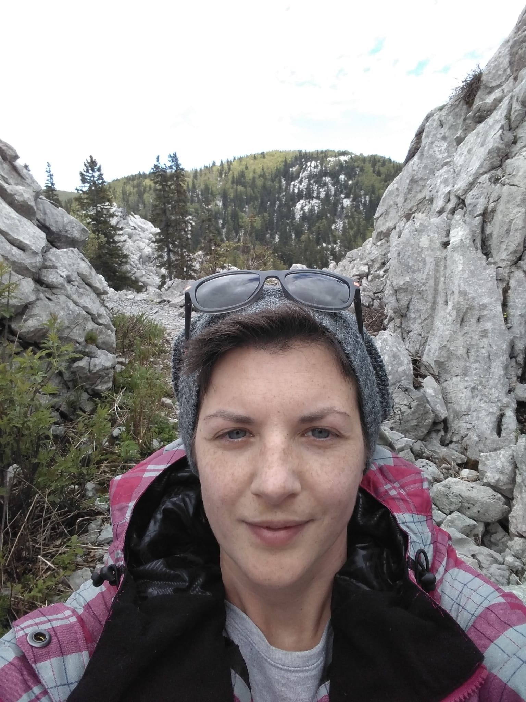

# Ivan

{height=50% width=50%}

Šarmantan momak, susjede zlatnih godina ga obožavaju. Nekad partijaner, danas uređuje biljke u vlastitom perivoju. Miran je i pristojan, osim ako mu netko ukrade vrtnog patuljka. Kaže da živi na Kvatriću ali zapravo živi u Republici Peščenici.  Fantastično kuha, a fantastično i gomila prljavo suđe. Dopušta gostima da dođu s Tupperwareom. Izumitelj nekoliko fenomenalnih plesnih pokreta koji su se prenijeli na nove generacije. 

# Jelena

{height=50% width=50%}

Za razliku od Ivana, Jelena nema sreće s biljkama. Čak ni s onim jednostavnim za održavanje. Fan pjevanja, joge i Coca-Cole. Naizgled nježna, no ipak je dijete Dubrave, pa nemojte da vas izgleda zavara. Poznata je po aktivnom slušanju, parafraziranju i reflektiranju osjećaja. Tim redoslijedom. Odnedavno proživljava novu mladost u  kojoj otkriva planinarenje, jahanje i skvoš. Ponosna je vlasnica Lune, francuske buldogice koja voli trešnje i za koju se sumnja da je vegetarijanka i neotkrivena sportašica.