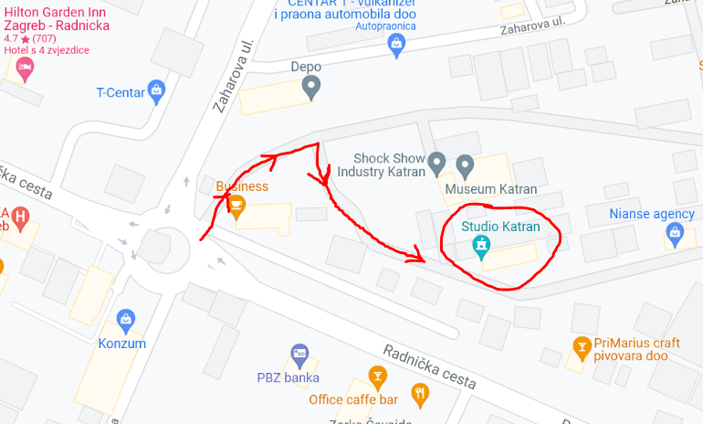

# Mjesto održavanja

Studio Katran

Radnička cesta 27

Zagreb

# Parking
Parking je osiguran i  besplatan za sve goste.

# Karta
Radnička cesta smještena je između Ulice kneza Branimira na sjeveru, Heinzlove ulice na istoku, Avenije Marina Držića na zapadu i Ulice grada Vukovara na jugu.

Radnička 27 nalazi se kod rotora u Radničkoj cesti. Na taj rotor izlaze Zaharova ulica i Ulica Petra Zoranića. Oko rotora se nalazi Konzum, zgrada T-coma, Hilton hotel i PBZ banka.

Ovo je ulaz u Radničku 27. Studio Katran je u dvorištu.

