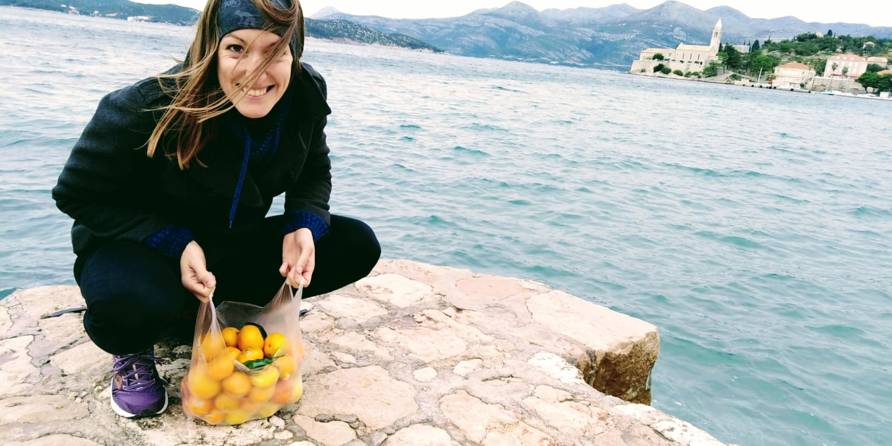

# Aleksandra

Njezin je mozak kao super računalo koje se odlučilo upaliti taman kad je vrijeme za spavanje. Manjak strpljenja nadoknađuje nedostatkom filtera u komunikaciji. Ne voli se grliti i dijeliti hranu. Obožava putovati, pogotovo u hladnije krajeve. Uvjerena je da ima fenomenalan smisao za humor. Od ljubavi prema kavi jača je samo ljubav prema palačinkama. Živčana kad je gladna. Poslije joj je žao. Svojom karizmom otapa i najtvrđa srca.

# Filip

Ninje kornjače obilježile su njegovo djetinjstvo. Nostalgično se sjeća ljetnog kina u Postirima na Braču. Povremeni je natjecatelj na picigin turnirima. U valovitom moru pliva bolje nego u bazenu. Po makadamu trči bolje nego po asfaltu. Na raspolaganju ima ½ kreveta, ¼ kreveta s lijeve i ¼ kreveta s desne strane. Za čitanje će vam preporučiti *Podrijetlo vrsta* Charlesa Darwina. U životu se tri puta selio, svaki put u (širem) centru Zagreba. Željno iščekuje 2046. godinu kada će Valentino Bošković održati koncert na Vidovoj gori.
